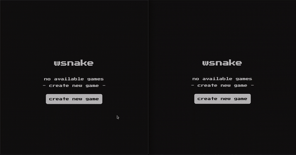

# wsnake

multiplayer snake game build with websocket

<p align="center">
  
</p>

### [live demo](https://wsnake.herokuapp.com/)

### development

server

```sh
cd server
npm start
```

client

```sh
cd client
npm start
```

### build with docker

docker

```sh
docker build -t wsnake ./
docker run -i --rm -p 3000:3000 --env PORT=3000 wsnake:latest
```