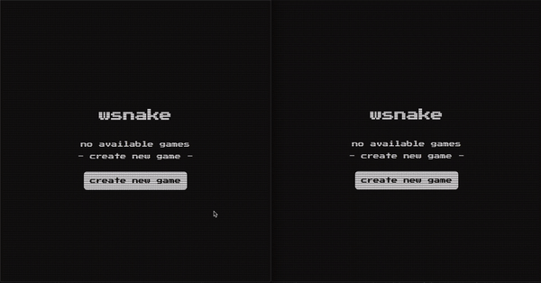
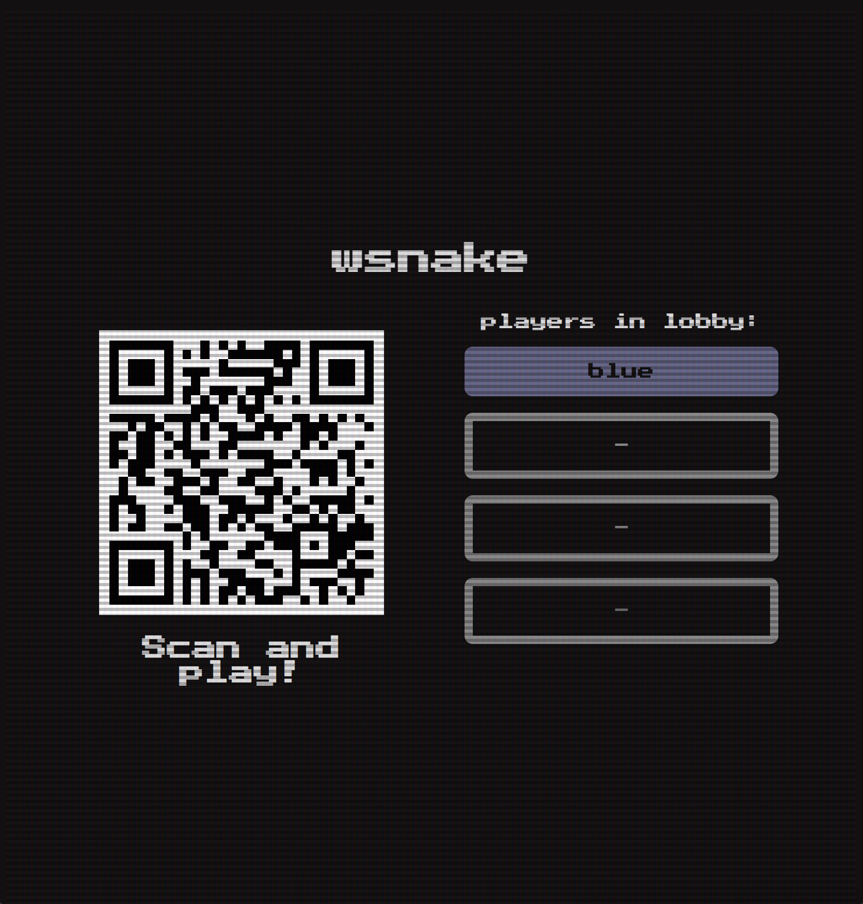

# wsnake

multiplayer snake game build with websocket

<p align="center">
  
</p>

### [live demo](https://wsnake.herokuapp.com/)

### development

server

```sh
cd server
npm start
```

client

```sh
cd client
npm start
```

### build with docker

docker

```sh
docker build -t wsnake ./
docker run -i --rm -p 3000:3000 --env PORT=3000 wsnake:latest
```

### hot-seat mode

To enable hot-seat mode go to `/previewer` route.

It will create a new game and show screen with lobby and QR code to scan and join the game.

<p align="center">
  
</p>

QR code directs to `/join?gameId=<game-id>` path. It adds the connected player to the room immediately after entering the link.

Game view is adjusted for mobile devices when joining from `/join` path - instead of game screen it displays arrow keys to control the snake. Other screens remain the same as for desktop.

To start the game at least 2 players need to be in the room and be marked as ready.

Current game finishes when all snakes are dead. The client with `/previewer` path - creates new game and displays the same screen as above. For clients using `/join` path - screen informing to scan the QR code once again is displayed
